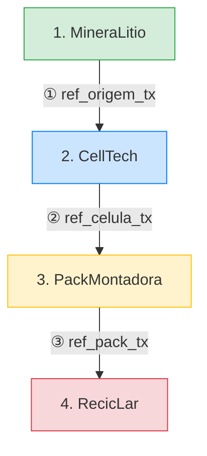
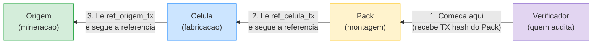
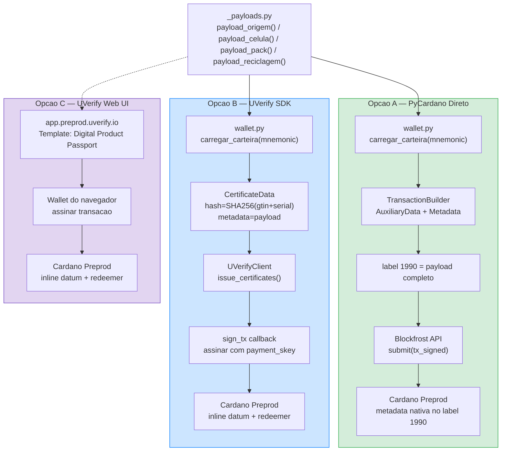
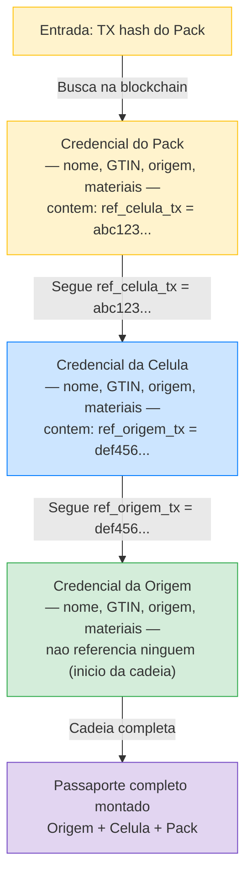
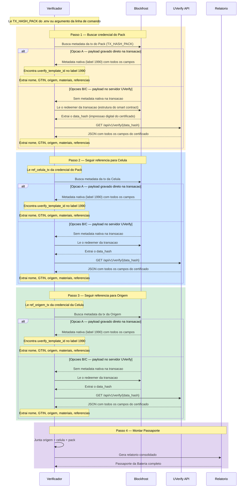

# Arquitetura do Passaporte Digital de Produto (DPP) — Bateria EV

Este documento descreve a arquitetura do sistema de rastreabilidade de baterias EV
sobre a blockchain Cardano. Cada diagrama pode ser visualizado em qualquer
ferramenta compativel com Mermaid (GitHub, VS Code, mermaid.live, etc.).

> **Publico-alvo:** Este documento foi escrito para desenvolvedores que **nao**
> possuem experiencia previa com blockchain. Todos os termos tecnicos sao
> explicados antes de serem usados. Ha tambem um [Glossario](#7-glossario)
> completo no final do documento.

---

## 1. Cadeia de Suprimentos

### Como funciona a cadeia

A cadeia de suprimentos e composta por **4 empresas** (atores). Cada empresa
registra uma credencial (certificado) na blockchain Cardano contendo informacoes
sobre sua etapa de producao.

**O ponto-chave:** cada empresa inclui no seu registro uma **referencia ao
registro da empresa anterior**. Isso cria uma corrente de ligacoes que permite
rastrear toda a historia de uma bateria, desde a mineracao ate a reciclagem.

Essas referencias sao feitas por dois campos:

- **`ref_*_tx`** — O TX hash (numero de protocolo) do registro da
  empresa anterior na blockchain. Com ele, voce pode localizar exatamente aquele
  registro.
- **`ref_*_data_hash`** — A impressao digital SHA-256 que permite buscar os
  dados completos na API do UVerify (util quando os dados nao estao diretamente
  na blockchain).

O verificador (quem audita) percorre essa cadeia **de tras para frente**: comeca
pelo Pack (montagem final), segue a referencia para Celula, depois para Origem,
montando assim o Passaporte completo da Bateria.

> **Nota:** RecicLar (Ator 4) referencia **todos** os 3 atores anteriores
> (`ref_origem_tx`, `ref_celula_tx`, `ref_pack_tx`), permitindo
> rastreabilidade completa em uma unica consulta. Cada referencia inclui
> tambem o `_data_hash` correspondente (sha256 do gtin+serial) para
> lookup na API UVerify.

**Legenda de cores:**
- Verde — Mineracao (origem da materia-prima)
- Azul — Fabricacao de celulas
- Amarelo — Montagem do pack
- Vermelho — Reciclagem (fim de vida)

> **Nota:** RecicLar referencia os 3 atores anteriores
> (`ref_origem_*`, `ref_celula_*`, `ref_pack_*`),
> permitindo rastreabilidade completa em uma unica consulta.
> Cada referencia inclui o par `_tx` (TX hash na blockchain)
> e `_data_hash` (sha256(gtin+serial) para lookup na API UVerify).

### Lendo as setas do diagrama

Cada seta representa uma **referencia gravada na blockchain**. Por exemplo:

- **MineraLitio → CellTech:** CellTech armazena no seu registro o TX hash e o
  data_hash do registro de MineraLitio. Isso significa: "as celulas que eu
  fabricou usam litio deste lote especifico da MineraLitio — aqui esta a prova."
- **CellTech → PackMontadora:** PackMontadora faz a mesma coisa referenciando
  o registro de CellTech.
- **Setas tracejadas para RecicLar:** RecicLar referencia **todos** os atores
  anteriores diretamente, permitindo uma auditoria completa em um unico ponto.

### Como o Verificador percorre a cadeia

O verificador funciona como um detetive seguindo pistas: comeca pelo registro
mais recente (Pack) e segue os links para tras ate chegar a origem da
materia-prima.

---

## 2. As 3 Opcoes de Emissao (A, B e C)

### O que significa "emitir uma credencial"?

Emitir uma credencial e o ato de **gravar o certificado de um produto na
blockchain**. E como registrar um documento no cartorio — depois de registrado,
ele fica la para sempre e qualquer pessoa pode verificar sua autenticidade.

O sistema oferece 3 caminhos diferentes para fazer esse registro. Todos partem
dos mesmos dados (definidos em `_payloads.py`) e resultam em uma transacao
confirmada na rede preprod.

### Entendendo on-chain vs off-chain

Antes de ver as opcoes, dois termos importantes:

- **On-chain** = gravado **dentro** da blockchain. Fica publico e imutavel para
  sempre. Qualquer pessoa pode ler. Analogia: o texto escrito na ficha do
  cartorio.
- **Off-chain** = armazenado **fora** da blockchain (num servidor convencional).
  A blockchain guarda apenas um ponteiro (o data_hash) para os dados. Analogia:
  o cartorio guarda apenas o numero do cofre; voce precisa ir ao cofre para ler
  o documento completo.

### Analogias para cada opcao

| Opcao | Analogia |
|-------|----------|
| **A — PyCardano Direto** | Como **enviar uma carta registrada para si mesmo**: voce escreve o documento inteiro, coloca no envelope, vai pessoalmente ao correio e despacha. Tudo esta dentro do envelope (on-chain). |
| **B — UVerify SDK** | Como **usar um despachante**: voce entrega os dados ao despachante (UVerify SDK), ele prepara a documentacao, voce assina, e ele envia ao cartorio. O cartorio guarda apenas o protocolo; o documento completo fica no escritorio do despachante. |
| **C — UVerify Web UI** | Como **usar o site do cartorio online**: voce preenche um formulario no navegador, assina digitalmente, e o servico cuida do resto. A forma mais simples, porem com menos controle programatico. |

### Resumo das diferencas

| Aspecto | Opcao A | Opcao B | Opcao C |
|---------|---------|---------|---------|
| **Modulo** | `emissor_direto.py` | `emissor_sdk.py` | UI web |
| **Armazenamento on-chain** | Metadata nativa (label 1990) | Inline datum + redeemer | Inline datum + redeemer |
| **Onde fica o payload** | Direto na metadata da tx (on-chain) | Servidor UVerify (off-chain) | Servidor UVerify (off-chain) |
| **Assinatura** | PyCardano `build_and_sign()` | Callback `sign_tx` via SDK | Wallet no navegador |
| **Dependencia externa** | Apenas Blockfrost | Blockfrost + UVerify SDK | UVerify Web |
| **Precisa de internet alem da blockchain?** | Nao (dados on-chain) | Sim (payload no servidor UVerify) | Sim (payload no servidor UVerify) |
| **Dados ficam publicos on-chain?** | Sim (payload inteiro visivel) | Nao (apenas hash on-chain) | Nao (apenas hash on-chain) |
| **Complexidade de codigo** | Media (construir tx manualmente) | Baixa (SDK abstrai a complexidade) | Nenhuma (interface visual) |

### Qual opcao escolher?

- **Opcao A** e ideal se voce quer **total independencia**: seus dados ficam
  inteiramente na blockchain, sem depender de nenhum servidor externo para
  leitura. Porem, os dados ficam publicos e o tamanho da transacao e maior.
- **Opcao B** e ideal para **integracao programatica** com privacidade: o SDK
  cuida da complexidade do smart contract, e o payload completo fica off-chain
  (voce controla quem acessa).
- **Opcao C** e ideal para **testes rapidos** ou usuarios nao-tecnicos: basta
  acessar o site, preencher o formulario e assinar com uma wallet de navegador.

---

## 3. Fluxo do Verificador

### O que faz o verificador?

O verificador (`verificador.py`) e o modulo que **le e audita** a cadeia de
suprimentos. Ele recebe como entrada o TX hash da ultima transacao (o Pack) e
percorre toda a cadeia de tras para frente, coletando os certificados de cada
empresa ate montar o Passaporte completo da Bateria.

### Como o verificador percorre a cadeia (de ator em ator)

O verificador comeca com um unico dado: o **TX hash do Pack** (ou da Reciclagem).
A partir dai, ele le a credencial desse ator e encontra dentro dela o campo
`ref_celula_tx` — que e o TX hash da credencial anterior. Usa esse hash para
buscar a credencial da Celula, que por sua vez contem `ref_origem_tx`. E assim
por diante, ate chegar na Origem (que nao referencia ninguem — e o inicio da cadeia).

Cada seta representa o verificador **seguindo uma referencia** gravada dentro
da credencial anterior. E como seguir pistas: cada certificado diz "o ator
anterior esta registrado nesta transacao" — e o verificador vai la conferir.

### Como funciona a busca (os dois caminhos)

Para cada certificado na cadeia, o verificador precisa recuperar os dados
completos. O problema e que os dados podem ter sido gravados de duas formas
diferentes (Opcao A ou Opcoes B/C). Por isso, o verificador tenta **dois
caminhos**, como um menu de restaurante com prato principal e alternativa:

1. **Caminho 1 — "Abrir o envelope" (metadata nativa):** Tenta ler os dados
   diretamente da blockchain (funciona se a credencial foi emitida pela Opcao A).
   E o caminho mais simples e rapido.

2. **Caminho 2 — "Ir ao cofre" (UVerify API):** Se o Caminho 1 nao encontrou
   dados, significa que a credencial foi emitida pelas Opcoes B/C. Nesse caso,
   o verificador precisa extrair o data_hash (impressao digital) da transacao e
   usá-lo para consultar o servidor UVerify, onde o payload completo esta
   armazenado.

### Termos tecnicos usados no diagrama abaixo

Antes de ler o diagrama de sequencia, duas definicoes rapidas:

- **Redeemer:** No contexto deste sistema, e uma estrutura de dados incluida na
  transacao que contem o data_hash do certificado. Pense nele como um "indice"
  que o smart contract usa para localizar o certificado. E a fonte mais confiavel
  para extrair o data_hash.

- **Inline datum:** Outra estrutura de dados na transacao, usada internamente
  pelo smart contract para manter o estado. Contem sequencias de 32 bytes que
  **podem** ser data_hashes, mas nao e garantido — por isso e um fallback
  heuristico (o verificador tenta, mas confirma antes de usar).

### Os dois caminhos de leitura por credencial — explicacao detalhada

Para **cada** credencial encontrada na cadeia, a funcao `buscar_credencial()`
tenta:

**Caminho 1 — "Abrir o envelope" (metadata nativa):**
O verificador chama `Blockfrost.transaction_metadata()` e procura por dados no
label 1990 que contenham um campo `uverify_template_id`. Se encontrar, converte
os dados para o formato interno `CredencialDPP` usando o `ParserCredencial`.
Este caminho funciona para credenciais emitidas pela Opcao A, onde o payload
inteiro esta dentro da transacao.

**Caminho 2 — "Ir ao cofre" (UVerify API):**
Se o Caminho 1 nao encontrou dados, o verificador precisa descobrir o data_hash
(a "chave do cofre") para buscar o payload no servidor UVerify. Ele reune
candidatos de **3 fontes**, da mais confiavel para a menos confiavel:

1. **(a) Hint** — A credencial anterior na cadeia ja pode ter fornecido o
   data_hash como referencia (campo `ref_*_data_hash`). E o atalho mais
   direto: "a empresa anterior ja me disse qual e a chave do cofre."

2. **(b) Redeemer on-chain** — A funcao `_extrair_hashes_do_redeemer()` le a
   estrutura de dados do redeemer na transacao. Dentro dela, o data_hash real
   do certificado esta armazenado em uma posicao conhecida. E a fonte mais
   confiavel quando o hint nao esta disponivel.

3. **(c) Inline datum** — A funcao `_walk_for_32byte()` varre os dados binarios
   (CBOR) do inline datum procurando sequencias de 32 bytes que possam ser
   data_hashes. E um fallback heuristico — pode encontrar falsos positivos,
   por isso o verificador sempre confirma com a API UVerify antes de aceitar.

Para cada candidato, o verificador chama `_verify_by_transaction_direct()`, que
faz `GET /api/v1/verify/{data_hash}` diretamente na API publica do UVerify.
O primeiro match valido e convertido em `CredencialDPP`.

> **Nota tecnica:** O verificador usa chamadas HTTP diretas (sem o SDK UVerify)
> para evitar um `RecursionError` causado por respostas JSON profundamente
> aninhadas na biblioteca do SDK.

---

## 4. Estrutura On-Chain

### Analogia visual: dois formatos de armazenamento

Imagine que voce esta registrando um documento num cartorio. Existem duas
formas de fazer isso:

- **Opcao A = "Documento grampeado ao recibo":** O documento inteiro (com todos
  os detalhes) fica fisicamente anexado ao recibo do cartorio. Qualquer pessoa
  que pedir o recibo recebe o documento completo junto.

- **Opcoes B/C = "Recibo com numero de cofre":** O recibo do cartorio contem
  apenas o numero de um cofre (o data_hash). Para ler o documento completo,
  voce precisa ir ao cofre (servidor UVerify) e apresentar o numero.

Os dois formatos de transacao coexistem na mesma rede e sao ambos lidos pelo
verificador. Apos o parsing, ambos convergem para a mesma estrutura
`CredencialDPP`.

### O que o verificador le de cada formato

| Elemento | Opcao A (metadata nativa) | Opcoes B/C (UVerify smart contract) |
|----------|--------------------------|--------------------------------------|
| **Onde esta o payload completo?** | Dentro da transacao, no label 1990 (on-chain) | No servidor UVerify, acessivel via API (off-chain) |
| **Como o verificador encontra?** | `Blockfrost.transaction_metadata(tx_hash)` | Extrai data_hash do redeemer/datum, depois `GET /api/v1/verify/{data_hash}` |
| **Vantagem** | Auto-contido — nenhuma dependencia externa para verificacao | Transacao menor on-chain; dados sensiveis podem ser controlados off-chain |
| **Desvantagem** | Payload inteiro fica publico; transacao ocupa mais espaco | Depende do servidor UVerify estar disponivel para leitura |

### Detalhes de cada formato

**Opcao A — metadata nativa:**
- O payload inteiro (todos os campos `name`, `issuer`, `gtin`, `mat_*`, `ref_*`, `cert_*`, etc.)
  e armazenado diretamente na metadata da transacao sob o label `1990`.
- Leitura: `Blockfrost.transaction_metadata(tx_hash)` retorna o dict completo.
- Vantagem: auto-contido, nenhuma dependencia externa para verificacao.

**Opcoes B/C — UVerify smart contract:**
- O `data_hash` (SHA-256 de `gtin + serial`) e embarcado no redeemer
  (estrutura `UVerifyStateRedeemer`) e em sequencias de 32 bytes no inline datum.
- O payload completo fica armazenado off-chain no servidor UVerify, acessivel via
  `GET /api/v1/verify/{data_hash}`.
- Leitura: extrair `data_hash` do redeemer (fonte confiavel) ou do inline datum
  (fallback heuristico), depois consultar a API publica do UVerify.
- Vantagem: transacao menor on-chain; dados sensiveis podem ser controlados off-chain.

**Convergencia:**
Independente do formato, o parser converte o resultado em `CredencialDPP`
(definido em `modelos.py`), com campos uniformes para `materiais`, `referencias`
e `data_hashes`. O `PassaporteBateria` e entao montado a partir de 3 instancias
de `CredencialDPP` (origem, celula, pack). Os `data_hashes` sao propagados de
uma credencial para a proxima como hints para acelerar o lookup UVerify.

---

## 5. Mapa de Arquivos

| Arquivo | Tipo | Descricao |
|---------|------|-----------|
| `_payloads.py` | Dados | Define os dados DPP dos 4 atores. Cada payload e um dicionario de pares chave-valor (nome do produto, GTIN, origem, pegada de carbono, materiais e referencias aos atores anteriores). As opcoes A e B usam os mesmos payloads. |
| `wallet.py` | Core | Deriva chave de assinatura e endereco preprod a partir de um mnemonico BIP-39 de 24 palavras usando o padrao CIP-1852. O endereco resultante e o mesmo que voce ve no Eternl ou Lace. Compartilhado por ambos os emissores. |
| `emissor_direto.py` | Emissao (A) | Constroi uma transacao Cardano com o `TransactionBuilder` do PyCardano, anexa o payload DPP como metadata nativa (label 1990), assina com a chave da carteira e submete via Blockfrost. Sem smart contract. |
| `emissor_sdk.py` | Emissao (B) | Emite atraves do SDK UVerify, que interage com smart contracts Plutus V3 na preprod. Inclui tratamento robusto para state datum, colateral, status codes, CIP-8 e exponential backoff. |
| `verificador.py` | Verificacao | Verificador unificado. Busca a credencial na chain (metadata nativa ou API UVerify), le as referencias `ref_*_tx` e percorre a cadeia ate a origem. Funciona com qualquer combinacao de metodos de emissao. |
| `modelos.py` | Dados | Define `CredencialDPP` (credencial individual com dados do produto, materiais e referencias) e `PassaporteBateria` (agrupa origem + celula + pack + reciclagem opcional). |
| `parser_credencial.py` | Parsing | Converte metadata bruta do Blockfrost em objetos `CredencialDPP` estruturados. Trata o template `digitalProductPassport` e classifica campos por prefixo (`ref_*`, `mat_*`, `uv_*`). |
| `relatorio_passaporte.py` | Relatorio | Gera o relatorio textual do passaporte no terminal apos a verificacao. |
| `relatorio_html.py` | Relatorio | Gera relatorio HTML com cards coloridos para cada etapa da cadeia (verde=origem, azul=celulas, amarelo=pack, teal=reciclagem). |
| `relatorio_emissao_html.py` | Relatorio | Gera recibo HTML apos cada emissao individual, com link para a transacao no Cexplorer. |
| `relatorio_reciclagem_html.py` | Relatorio | Gera relatorio HTML dedicado para a credencial de reciclagem (Ator 4). |
| `_html_utils.py` | Relatorio | Helpers compartilhados: escape de HTML e geracao de links Cexplorer preprod. |

---

## 6. Analogia Completa — O Cartorio de Baterias

Para entender o sistema inteiro de uma so vez, imagine a seguinte situacao
no mundo fisico:

### O cenario

Existe um **cartorio publico** (a blockchain Cardano) onde empresas registram
documentos sobre seus produtos. Esse cartorio tem duas caracteristicas especiais:
ninguem pode alterar um documento depois de registrado, e qualquer pessoa pode
pedir uma copia.

### Os atores

1. **MineraLitio** (mineradora) vai ao cartorio e registra um documento dizendo:
   "Extraimos litio do lote tal, na cidade tal, com esta composicao quimica."
   O cartorio devolve um **numero de protocolo** (TX hash).

2. **CellTech** (fabricante de celulas) vai ao cartorio e registra: "Fabricamos
   celulas de bateria usando o litio do lote tal. Aqui esta o **numero de
   protocolo do registro da MineraLitio** como prova."

3. **PackMontadora** (montadora) vai ao cartorio e registra: "Montamos um pack
   de bateria usando as celulas do lote tal. Aqui esta o **numero de protocolo
   do registro da CellTech** como prova."

4. **RecicLar** (recicladora) vai ao cartorio e registra: "Reciclamos este pack.
   Aqui estao os **numeros de protocolo de TODOS os registros anteriores** como
   prova de rastreabilidade completa."

### Os dois metodos de registro

- **Metodo A (carta registrada):** A empresa escreve o documento inteiro e
  entrega ao cartorio. O cartorio guarda o documento completo. Qualquer pessoa
  pode pedir uma copia e ler tudo.

- **Metodo B/C (cofre + protocolo):** A empresa entrega o documento a um
  **escritorio terceirizado** (UVerify). O escritorio guarda o documento em um
  cofre numerado, e a empresa vai ao cartorio registrar apenas: "O documento
  completo esta no cofre numero X do escritorio UVerify." Para ler o documento,
  voce precisa ir ao escritorio com o numero do cofre.

### O auditor

Um **auditor** (o verificador) quer montar o Passaporte completo de uma bateria.
Ele tem em maos apenas o numero de protocolo do ultimo registro (o Pack). Entao:

1. Vai ao cartorio e pede o registro do Pack.
2. Le o registro e encontra: "celulas vieram de CellTech, protocolo tal."
3. Vai ao cartorio e pede o registro de CellTech.
4. Le o registro e encontra: "litio veio de MineraLitio, protocolo tal."
5. Vai ao cartorio e pede o registro de MineraLitio.
6. Agora tem todos os documentos e monta o relatorio completo.

Em cada passo, se o documento estava no **Metodo A**, ele le direto no cartorio.
Se estava no **Metodo B/C**, ele anota o numero do cofre e vai ao escritorio
UVerify buscar o documento.

**Isso e exatamente o que o `verificador.py` faz, so que de forma automatizada
via APIs.**

---

## 7. Glossario

| Termo | Explicacao |
|-------|-----------|
| **Blockchain** | Banco de dados distribuido e imutavel — como um cartorio digital publico onde ninguem pode alterar os registros depois de gravados. |
| **Transacao (tx)** | Um registro gravado na blockchain. Cada transacao recebe um identificador unico chamado TX hash — equivalente ao numero de protocolo de um documento no cartorio. |
| **Metadata** | Dados adicionais anexados a uma transacao. Na Cardano, sao organizados por "labels" (numeros). Nosso sistema usa o label 1990. |
| **Smart contract** | Programa que roda na blockchain e valida dados automaticamente antes de permitir o registro. Como um funcionario-robo que confere formularios. |
| **Redeemer** | Estrutura de dados enviada junto com uma transacao para interagir com um smart contract. No nosso sistema, contem o data_hash do certificado. Pense nele como o "argumento" que voce passa ao funcionario-robo. |
| **Inline datum** | Dados armazenados diretamente na saida de uma transacao (ao inves de apenas seu hash). No nosso sistema, o smart contract UVerify armazena seu estado interno aqui. |
| **CBOR** | Formato binario compacto (Concise Binary Object Representation) usado pela Cardano para serializar dados on-chain. Similar ao JSON, mas em binario. |
| **UTxO** | Unspent Transaction Output — modelo contabil da Cardano. Cada transacao consome UTxOs anteriores e cria novos. Para este projeto, o relevante e que dados do smart contract ficam em UTxOs. |
| **data_hash** | Impressao digital SHA-256 calculada a partir de `gtin + serial`. Serve como chave unica para buscar o certificado completo no UVerify. |
| **SHA-256** | Algoritmo de hash criptografico que gera uma sequencia fixa de 32 bytes (256 bits) a partir de qualquer entrada. Mudar um unico caractere na entrada produz um hash completamente diferente. |
| **Blockfrost** | Servico SaaS que fornece uma API REST para ler dados da blockchain Cardano sem precisar rodar um no completo. |
| **UVerify** | Plataforma que emite e verifica certificados de produtos usando smart contracts na Cardano. Fornece SDK, API e interface web. |
| **Preprod** | Rede de testes da Cardano. Funciona como a rede principal, mas com dinheiro digital sem valor real — ideal para desenvolvimento. |
| **DPP** | Digital Product Passport — exigencia regulatoria da Uniao Europeia para rastreabilidade de baterias, cobrindo origem, composicao e ciclo de vida. |
| **Payload** | Conjunto de dados que compoe o certificado de um produto (nome, fabricante, GTIN, materiais, referencias, etc.). |
| **Credencial** | Sinonimo de certificado neste sistema — um registro verificavel com os dados de uma etapa da cadeia de suprimentos. |
| **Mnemonic** | Frase de 24 palavras que gera a carteira (wallet) Cardano. A partir dela derivam-se as chaves publica e privada para assinar transacoes. |
| **Wallet** | Carteira digital que armazena as chaves criptograficas necessarias para assinar transacoes na blockchain. |
| **Label 1990** | Numero arbitrario escolhido para identificar metadados DPP nas transacoes Cardano deste sistema. |
| **ref_*_tx** | Campo nos payloads que armazena o TX hash da credencial de outro ator na cadeia (referencia cruzada). Anteriormente chamado `cert_*_credential_tx`. |
