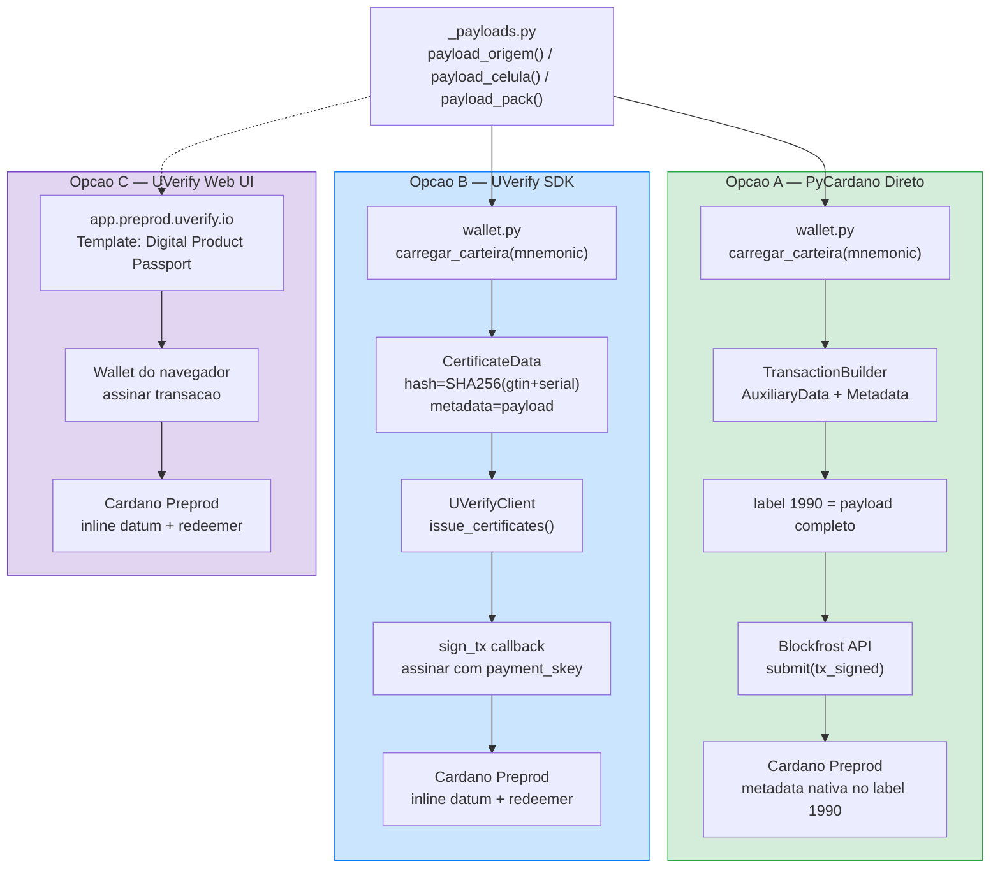
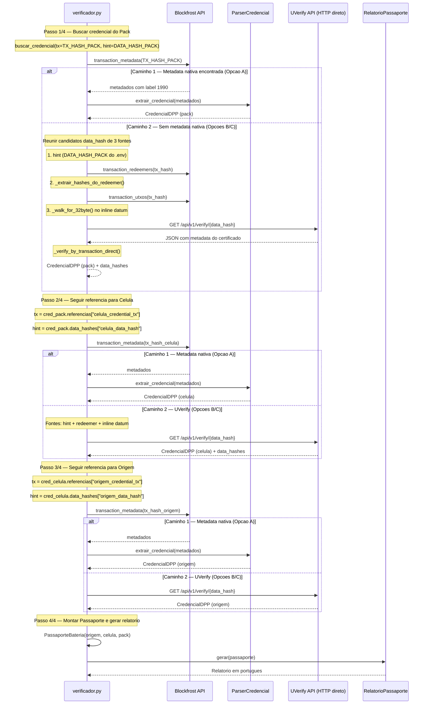
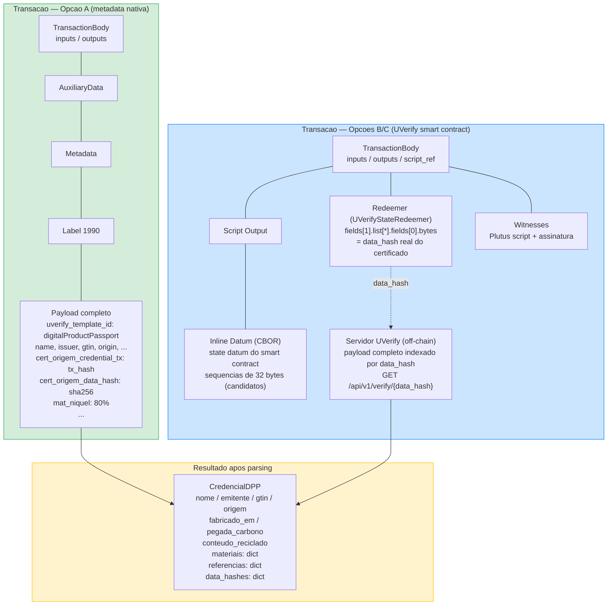

# Arquitetura do Passaporte Digital de Produto (DPP) — Bateria EV

Este documento descreve a arquitetura do sistema de rastreabilidade de baterias EV
sobre a blockchain Cardano. Cada diagrama pode ser visualizado em qualquer
ferramenta compativel com Mermaid (GitHub, VS Code, mermaid.live, etc.).

---

## 1. Cadeia de Suprimentos

A cadeia de suprimentos e composta por 4 atores. Cada ator emite uma credencial
na blockchain Cardano e referencia a credencial do ator anterior por meio dos
campos `cert_*_credential_tx` (tx hash) e `cert_*_data_hash` (impressao digital
SHA-256 para lookup UVerify). O verificador percorre essa cadeia **de tras para
frente** (pack &rarr; celula &rarr; origem) para montar o Passaporte da Bateria.

```mermaid
flowchart LR
    subgraph A1["MineraLitio"]
        direction TB
        a1p["Lote Litio Jequitinhonha 2026-03"]
        a1l["Aracuai, MG, BR"]
        a1s["Serial: ML-JQT-2026-03-042"]
    end

    subgraph A2["CellTech"]
        direction TB
        a2p["Celulas NMC 811 - Lote BA-2026-04-008"]
        a2l["Camacari, BA, BR"]
        a2s["Serial: CT-BA-2026-04-008"]
    end

    subgraph A3["PackMontadora"]
        direction TB
        a3p["Pack EV 75kWh - SP-2026-04-155"]
        a3l["Sao Bernardo do Campo, SP, BR"]
        a3s["Serial: PM-SP-2026-04-155"]
    end

    subgraph A4["RecicLar"]
        direction TB
        a4p["Reciclagem Pack 75kWh - SR-2031-08-001"]
        a4l["Sorocaba, SP, BR"]
        a4s["Serial: RL-SR-2031-08-001"]
    end

    A1 -- "cert_origem_credential_tx\ncert_origem_data_hash" --> A2
    A2 -- "cert_celula_credential_tx\ncert_celula_data_hash" --> A3
    A3 -- "cert_pack_credential_tx\ncert_pack_data_hash" --> A4

    A1 -. "cert_origem_credential_tx\ncert_origem_data_hash" .-> A4
    A2 -. "cert_celula_credential_tx\ncert_celula_data_hash" .-> A4

    style A1 fill:#d4edda,stroke:#28a745
    style A2 fill:#cce5ff,stroke:#007bff
    style A3 fill:#fff3cd,stroke:#ffc107
    style A4 fill:#f8d7da,stroke:#dc3545
```

**Legenda de cores:**
- Verde — Mineracao (origem da materia-prima)
- Azul — Fabricacao de celulas
- Amarelo — Montagem do pack
- Vermelho — Reciclagem (fim de vida)

> **Nota:** RecicLar referencia os 3 atores anteriores
> (`cert_origem_*`, `cert_celula_*`, `cert_pack_*`),
> permitindo rastreabilidade completa em uma unica consulta.
> Cada referencia inclui o par `_credential_tx` (tx hash na blockchain)
> e `_data_hash` (sha256(gtin+serial) para lookup na API UVerify).

---

## 2. As 3 Opcoes de Emissao (A, B e C)

O sistema oferece 3 caminhos para emitir uma credencial DPP na blockchain Cardano.
Todos partem do mesmo payload definido em `_payloads.py` e resultam em uma
transacao confirmada na rede preprod.

### Resumo das diferencas

| Aspecto | Opcao A | Opcao B | Opcao C |
|---------|---------|---------|---------|
| **Modulo** | `emissor_direto.py` | `emissor_sdk.py` | UI web |
| **Armazenamento on-chain** | Metadata nativa (label 1990) | Inline datum + redeemer | Inline datum + redeemer |
| **Onde fica o payload** | Direto na metadata da tx | Servidor UVerify (off-chain) | Servidor UVerify (off-chain) |
| **Assinatura** | PyCardano `build_and_sign()` | Callback `sign_tx` via SDK | Wallet no navegador |
| **Dependencia externa** | Apenas Blockfrost | Blockfrost + UVerify SDK | UVerify Web |

---

## 3. Fluxo do Verificador

O verificador (`verificador.py`) recebe o `TX_HASH_PACK` como ponto de entrada
e percorre a cadeia de referencias de tras para frente. Para cada credencial,
a funcao `buscar_credencial()` tenta dois caminhos de leitura: metadata nativa
(Opcao A) e API publica UVerify (Opcoes B/C).

### Os dois caminhos de leitura por credencial

Para **cada** credencial encontrada na cadeia, `buscar_credencial()` tenta:

1. **Caminho 1 (metadata nativa):** consulta `Blockfrost.transaction_metadata()`,
   procura por entrada com `uverify_template_id`, converte via
   `ParserCredencial.extrair_credencial()` em `CredencialDPP`.

2. **Caminho 2 (UVerify API):** reune candidatos a `data_hash` de **3 fontes**,
   em ordem de confiabilidade:
   - **(a) Hint** da credencial anterior na cadeia (campo `cert_*_data_hash`
     no payload, propagado via `CredencialDPP.data_hashes`) — atalho direto.
   - **(b) Redeemer on-chain** — `_extrair_hashes_do_redeemer()` navega a
     estrutura `UVerifyStateRedeemer.fields[1].list[*].fields[0].bytes`
     para extrair o hash real do certificado.
   - **(c) Inline datum** — `_walk_for_32byte()` varre o CBOR decodificado
     buscando sequencias de 32 bytes (fallback heuristico).

   Para cada candidato, chama `_verify_by_transaction_direct()` que faz
   `GET /api/v1/verify/{data_hash}` diretamente na API publica do UVerify
   (sem usar o SDK, para evitar `RecursionError` causado por respostas
   JSON profundamente aninhadas). O primeiro match valido e convertido em
   `CredencialDPP`.

---

## 4. Estrutura On-Chain

Os dois formatos de transacao coexistem na mesma rede e sao ambos lidos pelo
verificador. Apos o parsing, ambos convergem para a mesma estrutura
`CredencialDPP`.

### Detalhes de cada formato

**Opcao A — metadata nativa:**
- O payload inteiro (todos os campos `name`, `issuer`, `gtin`, `mat_*`, `cert_*`, etc.)
  e armazenado diretamente na metadata da transacao sob o label `1990`.
- Leitura: `Blockfrost.transaction_metadata(tx_hash)` retorna o dict completo.
- Vantagem: auto-contido, nenhuma dependencia externa para verificacao.

**Opcoes B/C — UVerify smart contract:**
- O `data_hash` (SHA-256 de `gtin + serial`) e embarcado no redeemer
  (estrutura `UVerifyStateRedeemer`) e em sequencias de 32 bytes no inline datum.
- O payload completo fica armazenado off-chain no servidor UVerify, acessivel via
  `GET /api/v1/verify/{data_hash}`.
- Leitura: extrair `data_hash` do redeemer (fonte confiavel) ou do inline datum
  (fallback heuristico), depois consultar a API publica do UVerify.
- Vantagem: transacao menor on-chain; dados sensiveis podem ser controlados off-chain.

**Convergencia:**
Independente do formato, o parser converte o resultado em `CredencialDPP`
(definido em `modelos.py`), com campos uniformes para `materiais`, `referencias`
e `data_hashes`. O `PassaporteBateria` e entao montado a partir de 3 instancias
de `CredencialDPP` (origem, celula, pack). Os `data_hashes` sao propagados de
uma credencial para a proxima como hints para acelerar o lookup UVerify.

---

## Mapa de Arquivos

| Arquivo | Funcao |
|---------|--------|
| `_payloads.py` | Definicao dos 4 atores e funcoes `payload_*()` |
| `wallet.py` | Derivacao HD wallet (CIP-1852) via mnemonic |
| `emissor_direto.py` | Opcao A — emissao com PyCardano + metadata nativa |
| `emissor_sdk.py` | Opcao B — emissao via UVerify SDK + callback de assinatura |
| `verificador.py` | Verificador unificado (A+B+C) com caminhada reversa |
| `parser_credencial.py` | Conversao de metadados brutos em `CredencialDPP` |
| `modelos.py` | Dataclasses: `CredencialDPP`, `PassaporteBateria` |
| `relatorio_passaporte.py` | Geracao do relatorio final em portugues |
| `cliente_blockfrost.py` | Wrapper de leitura para a API Blockfrost |
